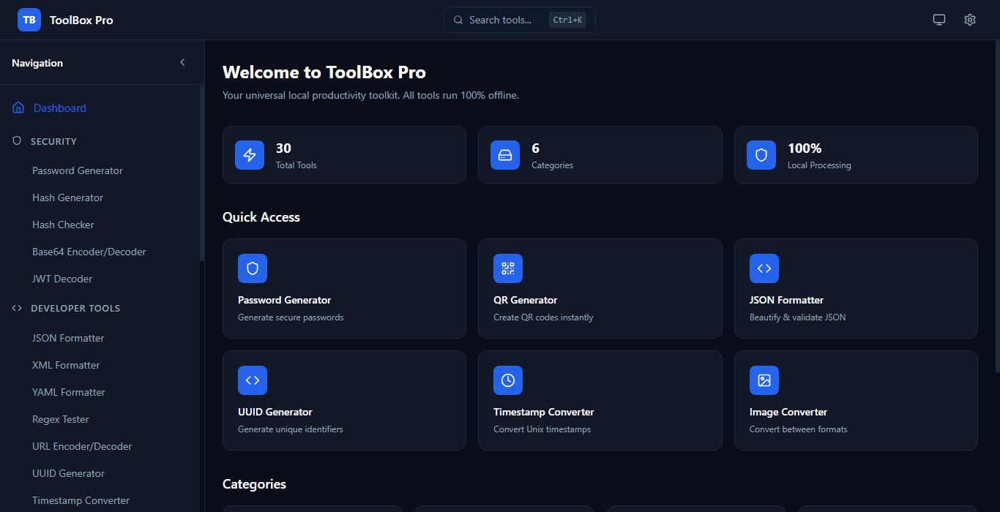
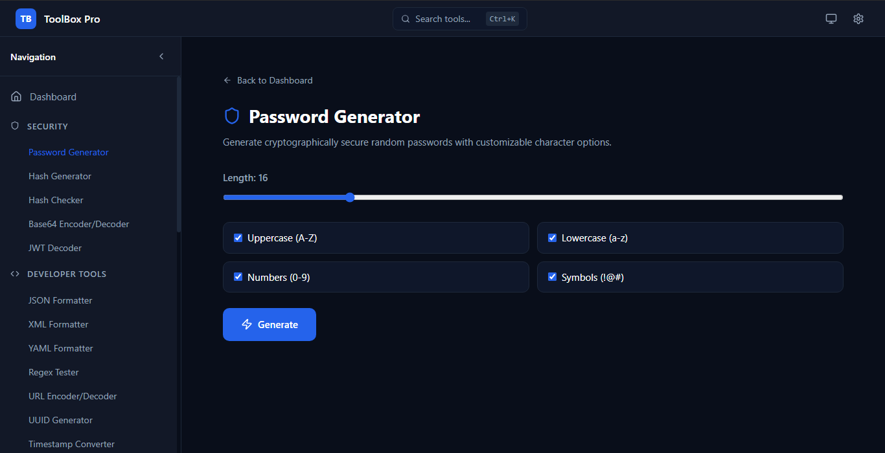
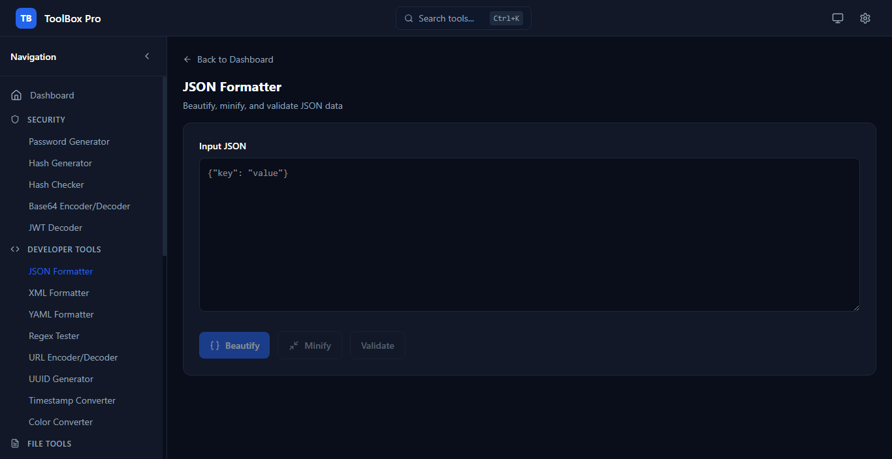

<div align="center">

# ToolBox Pro

**Universal Local Productivity Toolkit**

A modern desktop application containing multiple useful local tools in a single application. Works completely offline with a premium dark dashboard UI.

[](LICENSE)
[](https://www.electronjs.org/)
[](https://react.dev/)
[](https://www.typescriptlang.org/)
[](https://github.com/toolbox-pro/toolbox-pro/actions)

</div>

---

## Features

### Security Tools
- **Password Generator** - Generate secure passwords with customizable length, character types, and strength meter
- **Hash Generator** - Create MD5, SHA-1, SHA-256, and SHA-512 hashes
- **Hash Checker** - Compare and verify hash values
- **Base64 Encoder/Decoder** - Encode and decode Base64 strings
- **JWT Decoder** - Inspect JSON Web Token payloads

### Developer Tools
- **JSON Formatter** - Beautify, minify, and validate JSON
- **XML Formatter** - Format and validate XML documents
- **YAML Formatter** - Format and validate YAML files
- **Regex Tester** - Test regular expressions with match highlighting
- **URL Encoder/Decoder** - Encode and decode URLs
- **UUID Generator** - Generate UUID v4 identifiers
- **Timestamp Converter** - Convert between Unix timestamps and human-readable dates
- **Color Converter** - Convert between HEX, RGB, and HSL color formats

### File Tools
- **Remove Duplicate Lines** - Deduplicate text content
- **File Splitter** - Split large files into smaller parts
- **File Merger** - Combine multiple files into one
- **Folder Size Analyzer** - Analyze disk usage by folder
- **Duplicate File Finder** - Find duplicate files by content hash

### Image Tools
- **Image Converter** - Convert between PNG, JPG, WEBP, and BMP formats
- **Image Compressor** - Reduce image file sizes
- **Image Resizer** - Resize images to custom dimensions
- **Image Metadata Viewer** - View EXIF and other image metadata
- **Color Picker** - Pick colors from images or the screen

### QR & Barcode Tools
- **QR Generator** - Create QR codes for text, URLs, and WiFi configs
- **Barcode Generator** - Generate various barcode formats

### Productivity Tools
- **Notes** - Local note-taking with storage
- **To-Do Manager** - Task management with priorities
- **Pomodoro Timer** - Focus timer with work/break intervals
- **Stopwatch** - Precision timing
- **Countdown Timer** - Custom countdown with alerts

## Screenshots

<div align="center">







</div>

## Installation

### Prerequisites

- [Node.js](https://nodejs.org/) (v18 or higher)
- [npm](https://www.npmjs.com/) (v9 or higher)
- [Git](https://git-scm.com/)

### Clone the Repository

```bash
git clone https://github.com/toolbox-pro/toolbox-pro.git
cd toolbox-pro
```

### Install Dependencies

```bash
npm install
```

### Run in Development Mode

```bash
npm run dev
```

### Build for Production

```bash
# Windows
npm run build:win

# macOS
npm run build:mac

# Linux
npm run build:linux
```

## Project Structure

```
toolbox-pro/
├── src/
│   ├── main/                    # Electron main process
│   │   └── index.ts            # Main process entry point, IPC handlers
│   ├── preload/                 # Electron preload scripts
│   │   ├── index.ts            # Context bridge API
│   │   └── index.d.ts          # Type definitions
│   └── renderer/                # React frontend
│       ├── index.html           # HTML entry point
│       └── src/
│           ├── App.tsx          # Root component
│           ├── main.tsx         # React entry point
│           ├── assets/          # CSS and static assets
│           ├── components/      # Shared UI components
│           │   ├── layout/      # Dashboard layout, sidebar, navbar
│           │   └── ui/          # Reusable UI primitives
│           ├── lib/             # Utilities, theme, tool registry
│           ├── pages/           # Dashboard and settings pages
│           ├── store/           # Zustand state management
│           ├── tools/           # Tool implementations
│           │   ├── security/    # Security tools
│           │   ├── developer/   # Developer tools
│           │   ├── file/        # File manipulation tools
│           │   ├── image/       # Image processing tools
│           │   ├── qr/          # QR and barcode tools
│           │   └── productivity/# Productivity tools
│           └── types/           # TypeScript type definitions
├── build/                       # Build resources (icons)
├── resources/                   # App resources
├── docs/                        # Documentation
├── .github/                     # GitHub community files
├── package.json
├── tsconfig.json
├── electron.vite.config.ts
└── electron-builder.json5
```

## Technology Stack

| Category | Technology |
|----------|------------|
| Framework | [Electron](https://www.electronjs.org/) |
| UI Library | [React 19](https://react.dev/) |
| Language | [TypeScript](https://www.typescriptlang.org/) |
| Build Tool | [electron-vite](https://electron-vite.org/) |
| Styling | [Tailwind CSS 4](https://tailwindcss.com/) |
| State Management | [Zustand](https://github.com/pmndrs/zustand) |
| Animations | [Framer Motion](https://www.framer.com/motion/) |
| Icons | [Lucide React](https://lucide.dev/) |
| Packaging | [electron-builder](https://www.electron.build/) |

## Development

### Available Scripts

| Command | Description |
|---------|-------------|
| `npm run dev` | Start development server with hot reload |
| `npm run build` | Build the application |
| `npm run typecheck` | Run TypeScript type checking |
| `npm run build:win` | Build for Windows |
| `npm run build:mac` | Build for macOS |
| `npm run build:linux` | Build for Linux |

### Adding a New Tool

1. Create a new component in `src/renderer/src/tools/<category>/`
2. Implement the `ToolModule` interface:

```typescript
import type { ToolModule } from '@/types/tool'

export const myTool: ToolModule = {
  id: 'my-tool',
  name: 'My Tool',
  description: 'Description of what the tool does',
  icon: 'IconName',
  category: 'developer',
  keywords: ['keyword1', 'keyword2'],
  render: () => <MyToolComponent />
}
```

3. Register the tool in the category's `index.tsx`
4. The tool will automatically appear in the sidebar and search

## Configuration

ToolBox Pro works out of the box with no configuration required. All data is stored locally on your machine.

### Theme Customization

- **Dark Mode** (default)
- **Light Mode**
- **System Theme** (follows OS preference)
- **Custom Accent Color** - Choose any accent color

### Keyboard Shortcuts

| Shortcut | Action |
|----------|--------|
| `Ctrl+K` | Open search modal |
| `Esc` | Close modal / Go back |

## Contributing

We welcome contributions! Please see our [Contributing Guide](CONTRIBUTING.md) for details on:

- Setting up the development environment
- Coding standards
- Pull request process

## Security

For reporting security vulnerabilities, please see our [Security Policy](SECURITY.md).

## Changelog

See [CHANGELOG.md](CHANGELOG.md) for a list of changes.

## License

This project is licensed under the MIT License - see the [LICENSE](LICENSE) file for details.

## Acknowledgments

- Inspired by [Microsoft PowerToys](https://github.com/microsoft/PowerToys), [DevToys](https://github.com/veler/devtoys), and [Raycast](https://raycast.com/)
- Built with Electron, React, and Tailwind CSS
